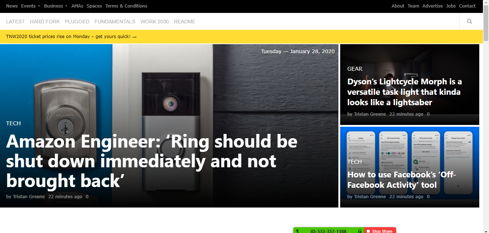

# Design Teardown

> This project consists of building a heatmap of the Smashing magazine website

## Built With

- HTML, CSS.

## Live Demo

[Live Demo Link](https://rawcdn.githack.com/xtrmdarc/Design-Teardown/ffb09065002f33d19d34d707cb0134a406462eb4/index.html)

## Author

👤 **Angel Benjamin Cussi**

- Github: [@githubhandle](https://github.com/abcussi)
- Twitter: [@twitterhandle](https://twitter.com/thecussi)
- Linkedin: [linkedin](https://www.linkedin.com/in/angel-cussi-1b2310174/)

👤 **Diego Antonio Reyes Coronado**

- Github: [@githubhandle](https://github.com/xtrmdarc)
- Twitter: [@twitterhandle](https://twitter.com/DiegoAn91629127)
- Linkedin: [linkedin](https://www.linkedin.com/in/diego-reyes-coronado-7a7189b7/)

## 🤝 Contributing

Contributions, issues and feature requests are welcome!

Feel free to check the [issues page](issues/).

## Show your support

Give a ⭐️ if you like this project!

## Acknowledgments

- Hat tip to anyone whose code was used
- Inspiration
- etc

